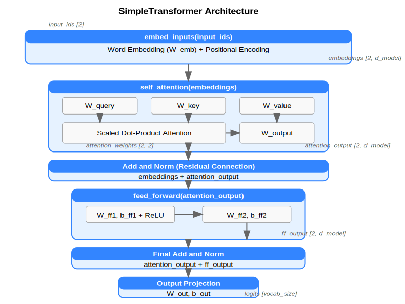

# BERT Simplified: Self-Attention and Embeddings Tutorial

A hands-on tutorial for understanding embeddings, the BERT model, transformers, and self-attention mechanisms.



## Overview

This standalone Python application implements a simplified BERT encoder using self-attention. The project emphasizes:

- **Simplicity**: Code that's easy to read and understand
- **Visualization**: See how the model processes data
- **CPU-friendly**: Train and run without specialized hardware
- **Authentic design**: Stays true to core BERT concepts

The implementation focuses on the core components of BERT:

1. **Embedding Layer**: Converts one-hot encoded words to dense vectors
2. **Self-Attention**: Allows the model to weigh the importance of different words in context
3. **Feed-Forward Networks**: Process the attention output
4. **Masked Language Modeling**: Predicts masked words based on context

By working with this simplified version, you can gain intuition about how larger transformer models function without the complexity of full-scale implementations.

Note that this is an educational tool and has several simplifications:

- Limited to two-word contexts
- Small vocabulary
- Single attention layer
- No fine-tuning phase

The mode embeds these two-word sentences containing a noun and attribute (in random order) with the following structure:

```
word1  word2  type1  type2
frog   green  noun   attribute
car    fast   noun   attribute
...
```

The model works with small contexts (2 tokens) and minimal vocabulary (64 nouns and 64 attributes), requires no complex tokenization (uses one-hot encoding with trainable linear transformations), trains via masked word prediction, and it is built from scratch with only NumPy as a dependency.

## Installation

```bash
git clone https://github.com/yourusername/bert-simplified.git
cd bert-simplified
python -m venv venv
source venv/bin/activate
pip install numpy matplotlib
```

## Usage

1. Create a training dataset

   ```bash
   python transformer.py --mode create_tsv --tsv_path my_data.tsv
   ```

2. Train the model

   ```bash
   python transformer.py --mode train --tsv_path my_data.tsv --steps 2000
   ```

3. Run inference with specific input

   ```bash
   python transformer.py --mode inference --input "frog [MASK]"
   ```

4. Run inference with default examples

   ```bash
   python transformer.py --mode inference
   ```

## Credits

This implementation was created with assistance from Claude, an AI assistant by Anthropic.

## License

[MIT License](LICENSE)
